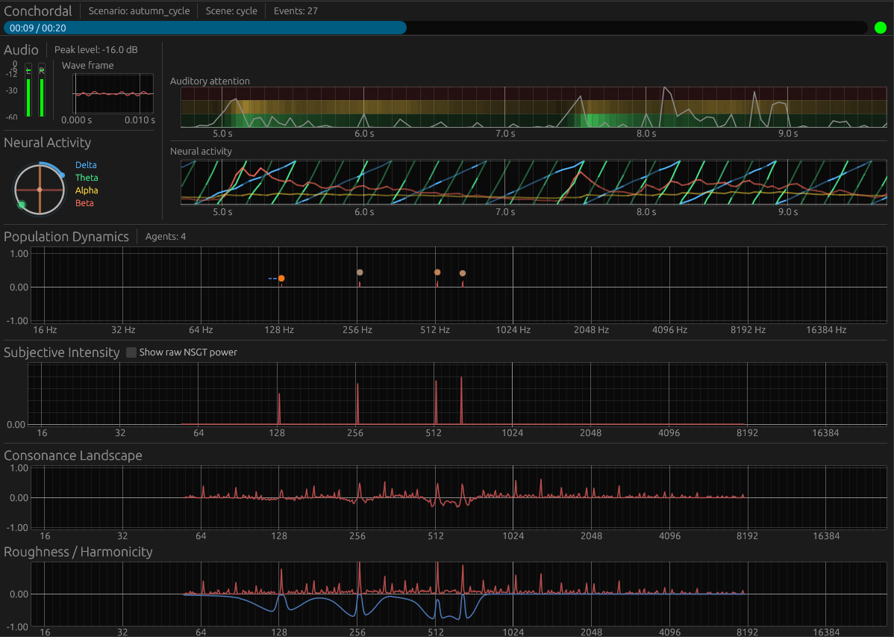

# Conchordal

**A bio-acoustic instrument for generative composition.**

> **Note: Research Alpha** — An early preview for researchers and developers. Features are incomplete and may be unstable. Composers and creators: please wait for beta.



## Concept: Emergence over Composition

Conchordal is a computational ecosystem where sound is treated as a living organism.

It does not rely on fixed grids—no equal temperament, no metronomic time. Instead, it simulates a **physiological environment** based on human auditory perception. Within this environment, autonomous "Individuals" struggle, coexist, and evolve.

Their survival depends on finding **Spectral Consonance** (minimizing sensory roughness) and establishing **Virtual Pitch** (maximizing harmonic stability). The resulting music is not composed by a human; it *emerges* from the physical interactions of sound itself.

## The Architecture

The system models a dynamic feedback loop across three layers, unifying Pitch (Space) and Rhythm (Time) under biological principles:

### 1. The Landscape (The Cognitive Environment)

The environment represents the structure of human hearing in both frequency and time domains:

* **Spectral Potential (Pitch):** Using a Non-Stationary Gabor Transform (NSGT) on a Log2 axis—simulating the **Cochlear Tonotopic Map**—it calculates potentials corresponding to physiological mechanisms:
    * **Roughness (R):** Simulates **Basilar Membrane Interference** (Critical Bands).
    * **Harmonicity (H):** Simulates **Neural Phase-Locking** (Temporal Periodicity detection).
    * **Consonance (C):** Simulates **Cognitive Integration**. The resultant fitness terrain ($C = H - R_{norm}$).

* **Neural Rhythms (Time):** Instead of a grid, rhythm emerges from entrainment to simulated **Neural Oscillations (Brainwaves)**:

	* **Delta Band (~0.5-4Hz):** Governs the macroscopic **Pulse** and musical **Phrasing**.

    * **Theta Band (~4-8Hz):** Dictates **Articulation** and syllabic grouping.

    * **Alpha Band (~8-13Hz):** Influences **Texture** and timbral fluctuation (e.g., unison detuning).

    * **Beta Band (~13-30Hz):** Controls micro-timing (groove) and ensemble tightness.
	

### 2. The Population (The Collective)

Sound is not a singular event but a mass phenomenon. The **Population** manages the aggregate state of all active agents. It represents the "species" or "society" of sound that inhabits the Landscape, handling the density, diversity, and collective spectral footprint that feeds back into the environment.

### 3. The Individual (The Agent)

The atomic unit of the system. Each **Individual** is an autonomous entity:
* **Proprioception:** It senses the Landscape's spectral potentials and synchronizes its internal clock to the environmental Neural Rhythms.
* **Metabolism:** It consumes energy to sustain articulation.
* **Autonomy:** It makes local decisions—drifting away from dissonance (segregation) or locking onto harmonic peaks (fusion)—without a central conductor.

## The Role of the Artist: Scenarios as Macro-Structure

While the *micro-structure* (harmony, rhythm, articulation) emerges autonomously, the **macro-structure** (the timeline and narrative arc) is crafted by the artist.

Using **Rhai** scripts, the creator acts not as a composer of notes, but as a **Director of Ecosystems**. Through the scenario file, you define:

* **Phases:** The sectional progression of the piece (e.g., "Genesis", "Conflict", "Resolution").
* **Interventions:** Injecting new populations or altering environmental constants (e.g., changing the system's "temperature" or consonance sensitivity).
* **Constraints:** Setting boundaries within which the system evolves.

This allows for the creation of structured "works" where the overall form is intentional, but the momentary details are emergent.

## Technical Stack

* Written entirely in **Rust** for high performance and memory safety.
* **Multi-platform** support (Linux, macOS, and Windows).
* Multi-threaded architecture with **lock-free concurrency** to ensure real-time DSP stability.
* High-performance **Non-stationary Gabor transform (NSGT)** analysis engine, complemented by dedicated psychoacoustic evaluation and synthesis kernels.
* Extensible **ALife engine** utilizing energy metabolism and Kuramoto-style entrainment for emergent behavior.
* Scenario scripting via an embedded **Rhai** interpreter for dynamic control.
* Real-time psychoacoustic monitoring and visualization via `egui`.

## Getting Started

### Installation & Run


Run a sample scenario.

```bash
git clone https://github.com/ktakahashi74/conchordal.git
cd conchordal
cargo run --release -- samples/03_structures/autumn_cycle.rhai
```

You need `libasound2-dev` installed on Linux (`cpal` requires ALSA headers).

### Experimentation

Define the ecosystem's initial conditions using Rhai scripts.

```rust
// Basic setup: Spawn 5 agents that seek harmonic stability
let life = #{ type: "decay", initial_energy: 1.0, half_life_sec: 2.0 };
let method = #{ mode: "harmonicity", min_freq: 200.0, max_freq: 1200.0 };

spawn_agents("my_swarm", method, life, 5, 0.15);
wait(10.0);
```

### Testing and other commands

Run the test suite with:

```bash
cargo test
```

If you want to pass the GitHub CI checks after code changes, run:

```bash
cargo fmt --all
cargo clippy -- -D warnings
```

The following command generates plot images under `target/` for visual kernel checks.

```bash
cargo test -- --ignored
```

If you want the docs to be up to date after changes, run:

```bash
cargo run --example gen_schemas
cargo run --example generate_script_docs
scripts/generate_rhai_docs.sh
```


## Timeline & Roadmap

- **circa. 1994** — Core concept conceived 
- **Aug 25th 2025** — Project started 
- **Dec 25th 2025** — Source & web release (pre-alpha) ← *current* 
- **Early 2026** — Demo scenario and tutorials
- **Summer 2026** — Beta, featuring first compositions


### Contributing

We invite engineers and artists who are exploring the frontiers of Auditory Scene Analysis and Computational Creativity. Check the Issue Tracker for open research topics.

### License

Distributed under the terms of both the MIT license and the Apache License (Version 2.0).

### Author

Created by Koichi Takahashi <info@conchordal.org>
