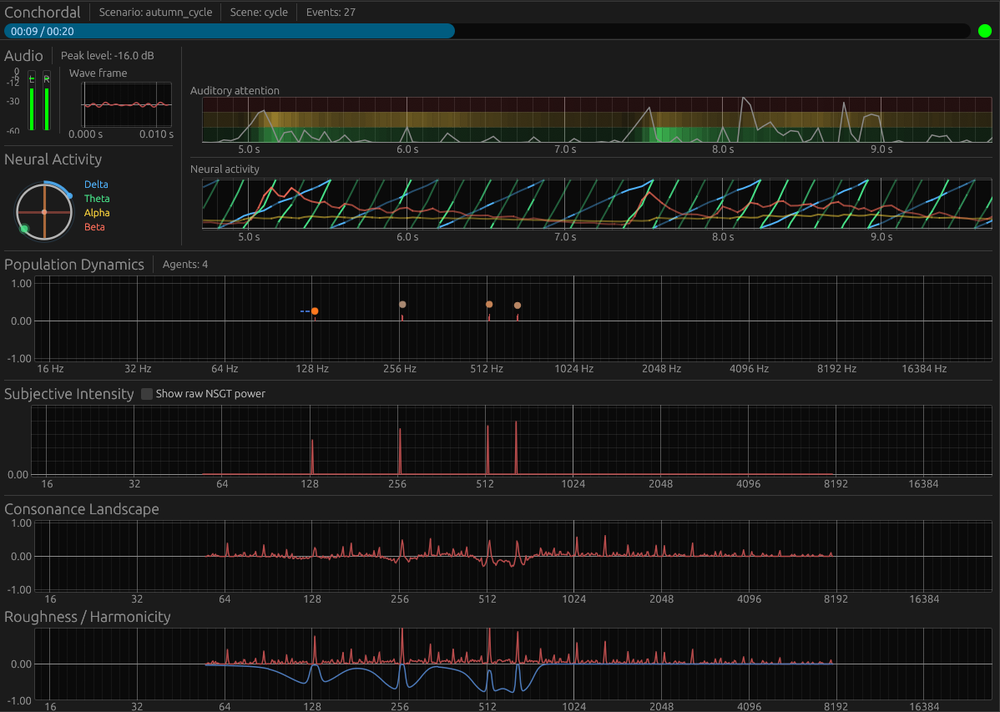

# Conchordal

**A bio-acoustic instrument for generative composition.**

> **v0.4.0 Alpha** — August 2026, accompanying an
> [oral presentation at ALIFE 2026](https://2026.alife.org/wp-content/uploads/sites/2/2026/08/ALIFE2026-Program-Semifinal-2026-08-10-Rev5-1.pdf#page=8).
> This is an early preview for researchers and developers: features are
> incomplete and APIs may change. Composers and creators should wait for beta.

Read the [paper](https://doi.org/10.48550/arXiv.2603.25637), explore the
[technical note](https://www.conchordal.org/technote/), or start with the
[Rhai scripting guide](https://www.conchordal.org/docs/rhai/).



## Concept: Emergence over Composition

Conchordal is a computational ecosystem where sound is treated as living
material.

It does not rely on equal temperament or a metronomic grid. Instead, autonomous
**Voices** inhabit a continuous perceptual **Landscape** derived from the sound
they collectively produce. Scenario scripts place Voices as persistent
**Populations**; all Populations sharing the runtime terrain form the
**Community**.

Harmony emerges as Voices reshape and respond to a Consonance Field built from
sensory roughness and harmonicity. Rhythm emerges as their onset oscillators
couple to a shared meter driven by the Community itself. When lifecycle and
viability policies are enabled, perceptual fit also affects energy, death, and
respawn. The artist shapes the conditions and the arc; the exact pitches,
timing, and turnover emerge during performance.

## The Architecture

The generative core has three interacting layers. A separate listener-side loop
observes the sound presented to the audience.

### 1. The Landscape (The Cognitive Environment)

The Landscape represents auditory structure in frequency and time:

* **Consonance Field (Pitch):** A Non-Stationary Gabor Transform (NSGT)
  analyzes the habitat bus on a Log2-frequency axis. Dedicated kernels compute:
    * **Roughness (R):** sensory dissonance from interference within critical bands.
    * **Harmonicity (H):** periodicity and virtual-pitch template matching.
    * **Consonance (C):** an evaluation field derived from roughness and harmonicity.

* **Emergent Meter (Time):** Instead of a fixed filterbank or imposed clock,
  a forced limit-cycle oscillator listens to the Community's own onsets, learns
  a shared beat, and reports confidence through phase locking. Each Voice has a
  coupling clock on a single continuum:
    * **Metric:** strong attraction to the shared beat.
    * **Entrained:** synchronization emerges as confidence grows.
    * **Flow:** weakly coupled, clustered renewal timing without a beat grid.

  The Director shapes where a pulse can form through soft priors such as
  `meter_stability` and `temporal_basin`; it does not schedule the beat.

### 2. The Community (The Collective)

Sound is not a singular event but a mass phenomenon. The runtime **Community**
aggregates every placed **Population** that shares the Landscape, handling the
density, diversity, and collective spectral footprint that feeds back into the
environment. A Population keeps its identity while its living members and
generations change.

### 3. The Voice (The Agent)

The atomic unit of the system. Each **Voice** is an autonomous entity:
* **Perception–action coupling:** It reads the effective Consonance Field and
  couples its onset phase to the shared emergent meter.
* **Metabolism:** Configured lifecycle policies can make articulation consume
  energy and consonance replenish it.
* **Autonomy:** Configured pitch, rhythm, phonation, and respawn policies act
  locally without a central note sequencer.

### 4. Presentation and the Listener

Every Voice can feed two independent buses. The **habitat bus** drives NSGT
analysis and the Landscape; the **presentation bus** is what the audience,
offline renderer, and ListenerTwin receive. Both are enabled by default, while
scripts may route a Voice to either side deliberately.

The **ListenerTwin** estimates stability, resolvability, tension, attention,
and meter from the presented sound only. Optional Direct Cognitive Coupling
(DCC) can feed a bounded listener-derived exploration pressure back into pitch
behavior. It is report/UI-only by default (`coupling_strength = 0.0`).

## The Role of the Artist: Scenarios as Macro-Structure

While the *micro-structure* (harmony, rhythm, articulation) emerges autonomously, the **macro-structure** (the timeline and narrative arc) is crafted by the artist.

Using **Rhai** scripts, the creator acts not as a composer of notes, but as a
**Director of Ecosystems**. Through a scenario file, you define:

* **Phases:** sectional progression with `section`, `play`, `parallel`, and `wait`.
* **Interventions:** placing or releasing Populations and live-patching controls
  such as search `temperature`.
* **Terrain:** placement strategies, routing, `meter_stability`, and
  `temporal_basin` shape where harmony and pulse can form.
* **Constraints:** bodies, registers, lifecycles, and respawn policies define
  the space in which the system evolves.

This allows for the creation of structured "works" where the overall form is deliberate, but the momentary details are emergent.

## Technical Stack

* The core instrument, DSP, ALife runtime, and GUI are written in **Rust**.
* CI covers **Linux, macOS, and Windows**.
* A multi-threaded runtime isolates the audio callback with an SPSC ring buffer
  and uses channels for rendering, analysis, UI, and reporting handoffs.
* High-performance **Non-stationary Gabor transform (NSGT)** analysis engine, complemented by dedicated psychoacoustic evaluation and synthesis kernels.
* **ALife engine** with configurable energy metabolism, lifecycle, respawn,
  local pitch search, and Kuramoto-style entrainment.
* Scenario scripting via an embedded **Rhai** interpreter for dynamic control.
* Real-time psychoacoustic and ListenerTwin visualization via `egui`.

## Getting Started

### Installation & Run

Install a current stable Rust toolchain. On Ubuntu, also install the native
dependencies used by CI:

```bash
sudo apt-get install libasound2-dev libudev-dev libwayland-dev \
    libxkbcommon-dev libfontconfig1-dev pkg-config
```

Then run a sample scenario in release mode (recommended for real-time DSP):

```bash
git clone https://github.com/ktakahashi74/conchordal.git
cd conchordal
cargo run --release -- samples/12_emergence_and_resolution.rhai
```

The alpha ships with twelve ordered samples under `samples/`. Each is a small
demonstration of one or more instrument capabilities:

```bash
cargo run --release -- samples/01_a_single_voice.rhai
cargo run --release -- samples/07_heartbeat.rhai
cargo run --release -- samples/12_emergence_and_resolution.rhai
```

See [`samples/README.md`](samples/README.md) for the full path. These are API
and behavior samples, not musical works; compositions arrive with the beta.
`samples/research/` holds comparison assays outside the path.

### Scenario scripting example

Create a scenario using Rhai scripts as follows and save it as `sample.rhai`.

```rhai
let soft = sine()
    .amp(0.08)
    .sustain();

place(soft, line(220.0, 440.0).count(3));
wait(2.0);
```

Then run the script with:

```bash
cargo run --release -- sample.rhai
```

### Testing and other commands

Before submitting code changes, run:

```bash
cargo fmt --all -- --check
cargo clippy -- -D warnings
cargo test
```

The following command generates plot images under `target/plots/` for visual
kernel checks.

```bash
cargo test --features plotcheck plot_
```

### Running options

See the complete current CLI surface with:

```bash
cargo run --release -- --help
```

Common operations:

* Config file: `--config config.toml`
* Headless playback: `--nogui`
* Silent simulation: `--play=false`
* Compile without GUI, audio, or execution: `--compile-only`
* Write a JSONL runtime report: `--report run.jsonl`
* Replay a logged run: `--seed <SEED>`
* Start on a performance cue: `--wait-user-start`
* Exit when the scenario ends: `--wait-user-exit=false`

For example, run headless while recording a report:

```bash
cargo run --release -- sample.rhai --nogui --report run.jsonl
```

Compile-only checking:

```bash
cargo run --release -- sample.rhai --compile-only
```

Setting log levels with `RUST_LOG`:

```bash
RUST_LOG=debug cargo run --release -- sample.rhai
```

Log levels are `error`, `warn`, `info`, `debug`, and `trace`.

### Offline WAV rendering

The `conchordal` instrument never writes audio to disk. Render a kept scenario
with the separate `conchordal-render` binary:

```bash
cargo run --release --bin conchordal-render -- \
    samples/12_emergence_and_resolution.rhai -o performance.wav --seed <SEED>
```

The renderer shares the core engine but is not the real-time instrument.

## Timeline & Roadmap

- **circa 1994** — Core concept conceived
- **Aug 25, 2025** — Project started
- **Dec 25, 2025** — Source & web release (pre-alpha)
- **Mar 2026** — v0.3.0 pre-alpha paper release
- **Aug 2026** — v0.4.0 Alpha for the ALIFE 2026 oral presentation: emergent-meter rhythm/harmony ecology, ListenerTwin, and a tiered scripting API ← *current*
- **2026–2027** — Beta with first compositions

## Contributing

We invite engineers and artists exploring Auditory Scene Analysis and
Computational Creativity. Check the
[Issue Tracker](https://github.com/ktakahashi74/conchordal/issues) for open
research topics.

## License

Distributed under the terms of both the MIT license and the Apache License (Version 2.0).

## Citation

For research use, see [`CITATION.cff`](CITATION.cff). The preferred citation is
the accompanying paper, “Conchordal: Emergent Harmony via Direct Cognitive
Coupling in a Psychoacoustic Landscape”
([arXiv:2603.25637](https://doi.org/10.48550/arXiv.2603.25637)).

## Author

Created by Koichi Takahashi <contact@conchordal.org>
